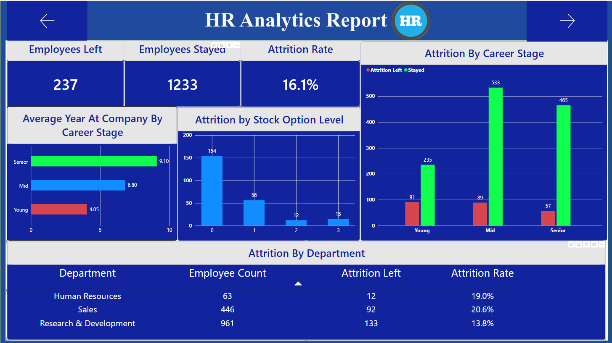
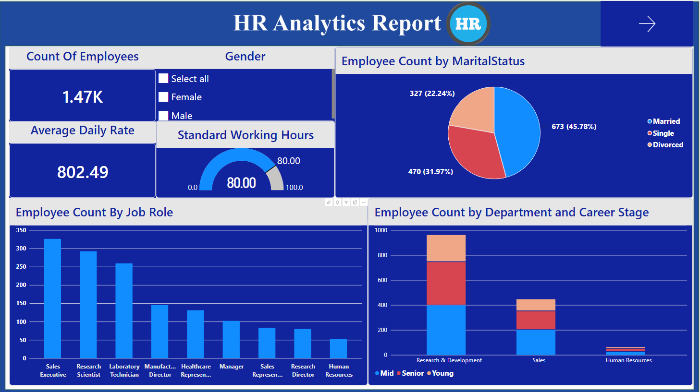
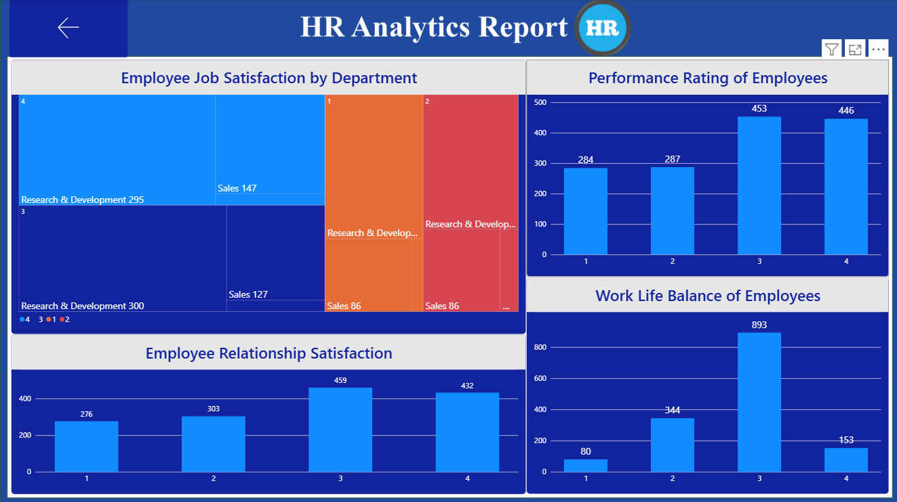

# HR Analytics Dashboard

## Overview

An interactive HR Analytics dashboard built using Microsoft Power BI to analyze employee attrition, workforce demographics, job roles, income, job satisfaction, and other HR-related metrics.

## Key Analysis

- Employee attrition and attrition rate
- Department-wise and job-role analysis
- Employee demographics
- Monthly income analysis
- Job satisfaction
- Work-life balance
- Stock option levels
- Employee experience and tenure
- Workforce and attrition trends

## Tools & Technologies

- Power BI
- DAX
- Power Query
- Data Cleaning & Transformation
- Data Modeling
- Data Visualization

## Dashboard Preview

## Project Pages

### Page 1

### Page 2

### Page 3

## Skills Demonstrated

- Data Cleaning
- Data Transformation
- Data Modeling
- DAX
- KPI Development
- Interactive Dashboard Design
- Business Intelligence
- Data Analysis
